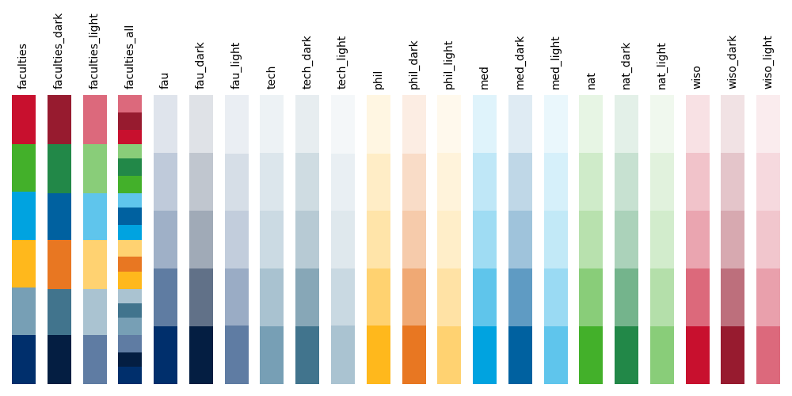

# FAU - Colors

The official colors of the Friedrich-Alexander-Universität Erlangen-Nürnberg (FAU) as matplotlib/seaborn colormaps.

We support the old colors based on the 
[2019 CI-guidelines](https://www.intern.fau.de/files/2020/03/FAU-Design-Manual.pdf) and the brand new
[2021 Brand redesign](https://www.intern.fau.de/files/2021/10/fau_styleguide-essentials.pdf).

## Installation

```
pip install mad_colors
```

## Quick Guide

#### 2021 colormaps



```python
import seaborn as sns

from fau_colors.v2021 import register_cmaps
register_cmaps()

sns.set_palette("tech")
```

#### 2019 colormaps


```python
import seaborn as sns

from fau_colors.v2019 import register_cmaps
register_cmaps()

sns.set_palette("tech")
```

## General Usage

The 2019 and the 2021 colors are available in the separate submodules `fau_colors.v2019` and `fau_colors.v2021` that 
contain equivalent functions.

The methods below show the usage with the new color scheme.
For the old colors simply replace the module name.

### Registering color palettes

The easiest way to use the provided color palettes is to register them as global matplotlib colormaps.
This can be done by calling the `register_cmaps()` function from the respective submodule.
All available cmaps can be seen in the images above.

```pycon
>>> from fau_colors.v2021 import register_cmaps
>>> register_cmaps()
```

**WARNING: The 2019 and 2021 cmaps have overlapping names! This means you can not register both at the same time.
You need to call `unregister_cmaps` from the correct module first, before you can register the other colormaps.
If you need colormaps from both CI-guides, use them individually, as shown below.**


### Getting the raw colors

All primary department colors are stored in a `namedtuple` called `colors`.

```pycon
>>> from fau_colors.v2021 import colors
>>> colors
DepartmentColors(fau='#002F6C', tech='#779FB5', phil='#FFB81C', med='#00A3E0', nat='#43B02A', wiso='#C8102E')
>>> colors.fau
'#002F6C'
```

For the 2021 color scheme also the variable `colors_dark` and `colors_all` are available that contain the dark variant 
of each color and light and dark colors combined, repectivly.

### Manually getting the colormaps

The colormaps are stored in a `namedtuple` called cmaps.
There are colormaps for the primary colors and colormaps with varying lightness using each color as the base color.
The latter colormaps contain 5 colors each with 12.5, 25, 37.5, 62.5, and 100% value of the base color.
If you need more than 5 colors see below.

```pycon
>>> from fau_colors.v2021 import cmaps
>>> # Only get the names here
>>> cmaps._fields
('departments', 'departments_dark', 'departments_all', 'fau', 'fau_dark', 'tech', 'tech_dark', 'phil', 'phil_dark', 'med', 'med_dark', 'nat', 'nat_dark', 'wiso', 'wiso_dark')
>>> cmaps.fau_dark
[(0.01568627450980392, 0.11764705882352941, 0.25882352941176473), (0.3823913879277201, 0.4463667820069205, 0.5349480968858131), (0.629434832756632, 0.6678200692041523, 0.7209688581314879), (0.7529565551710881, 0.7785467128027682, 0.8139792387543252), (0.876478277585544, 0.889273356401384, 0.9069896193771626)]
>>> import seaborn as sns
>>> sns.set_palette(cmaps.fau_dark)
```

### Modifying the color colormaps

Sometimes five colors are not enough for a colormap.
The easiest way to generate more colors, is to use one of the fau colors as base and then create custom sequential
pallets from it.
This can be done using `sns.light_palette` or `sns.dark_palette`, as explained 
[here](https://seaborn.pydata.org/tutorial/color_palettes.html#custom-sequential-palettes)

```pycon
>>> from fau_colors.v2021 import colors
>>> import seaborn as sns
>>> sns.light_palette(colors.med, n_colors=8)
[(0.9370639121761148, 0.9445189791516921, 0.9520035391049294), (0.8047725363394869, 0.9014173378043252, 0.9416168802970363), (0.6688064000629526, 0.8571184286417537, 0.9309417031889239), (0.5365150242263246, 0.8140167872943868, 0.9205550443810308), (0.40054888794979027, 0.7697178781318151, 0.9098798672729183), (0.2682575121131623, 0.7266162367844482, 0.8994932084650251), (0.13229137583662798, 0.6823173276218767, 0.8888180313569127), (0.0, 0.6392156862745098, 0.8784313725490196)]
```
